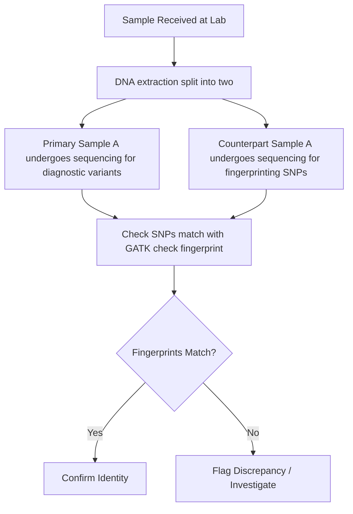

# Prac 2 Failing loudly - handling error in clinical screening

#### By Evelyn Collen


## **1. Introduction**

### What happens when we can't afford to fail - DPYD pharmacogenomic screening 


In last week's practical, we started to get the hang of handling failing scripts and the concept that failure, in general, isn't a bad thing! Here we are going to focus on how we can best handle errors in diagnostic reporting. 

The DPYD gene is responsible for generating the dihydropyrimidine dehydrogenase (DPD) enzyme, which plays a key role in the metabolism of toxic compounds. Deficiency in this enzyme can cause fatal toxicity to fluoropyrimidine chemotherapy treatments (e.g., 5-fluorouracil, capecitabine), which are widely used in the treatment of solid tumour cancers. Variants in the DPYD can impair functionality in the DPD enzyme's function, categorised into zero, decreased, or normal function. 

It's important to optimise the variant-tailored dosage, as the standard dose that is effective for some people can be fatal for certain variant carriers. Severe toxicity to these drugs occurs in about 10% to 40% of patients, and around 7% of Europeans carry some variant that impairs function. In South Australia, there has unfortunately been a recorded case of patient fatality due to DPD enzyme deficiency and an incorrectly tailored dosage. 


Figure 1. The relative risk of toxicity in those with versus without the
specified variant when treated with full or individualised dose (taken from [Sonic Genetics](https://www.sonicgenetics.com.au/))

### 1.1 Reminder about virtual Machines

As usual we will be connecting the virtual machines: 

**Please [go here](../../Course_materials/vm_login_instructions.md) for instructions on connecting to your VM.**

### 1.2 Learning Outcomes

1. Understand clinical failure in a clinical bioinformatics and how to minimise it
2. Learn troubleshooting errors from bioinformatic tools
3. Learn about how clinical screening results are curated and reported out 
4. Learn about variant reporting in the DPYD gene

### 1.3 About the dataset

Today we are looking at four patients, who I have anonymised to Patient A, Patient B, Patient C and Patient D. There is a bonus Patient E who has not been reported out, and you will soon find out why. 

Patients A,B,C and D have had real diagnostic reports issued out for them, and you can have a look at the anonymised versions here. [DPYD patient reports](images_and_refs/Patient_reports.docx)
If you have time at the end of the prac or in your spare time, I have put some bonus questions regarding these reports. 

## **2. Errors with sample integrity**

### 2.1 Getting scripts and data ready

Let's load up our data and scripts!

load software
```bash
source activate bioinf
pip install xlsxwriter
```

create all directories and move into project directory
```bash
mkdir -p ~/Practical_Failing_Loudly2/{0_scripts,1_vcfs,2_bam,3_reports,4_refs}
mkdir -p ~/Practical_Failing_Loudly2/1_vcfs/counterpart_vcfs
mkdir -p ~/Practical_Failing_Loudly2/3_reports/{1_fingerprint_check,2_contam_check,3_varcall_check}
cd ~/Practical_Failing_Loudly2
```

copy scripts and data and also make symlinks

```bash
cp ~/data/failing_loudly/0_scripts/* 0_scripts/
ln -s ~/data/failing_loudly/1_vcfs/*.vcf 1_vcfs/
ln -s ~/data/failing_loudly/1_vcfs/*.vcf.gz* 1_vcfs/
ln -s ~/data/failing_loudly/1_vcfs/counterpart_vcfs/*.vcf.gz* 1_vcfs/counterpart_vcfs/
ln -s ~/data/failing_loudly/2_bam/*.bam* 2_bam/
ln -s ~/data/failing_loudly/4_refs/Homo_sapiens_assembly38.fasta 4_refs/Homo_sapiens_assembly38.fasta
ln -s ~/data/failing_loudly/4_refs/HaplotypeMap.vcf 4_refs/HaplotypeMap.vcf
ln -s ~/data/failing_loudly/4_refs/DPYD_variants_genome_location.csv 4_refs/DPYD_variants_genome_location.csv
```

### 2.2 Checking a sample's integrity with genetic fingerprinting

The throughput of NGS samples going through clinical laboratories is really high, and getting higher every year. Some labs are seeing more than 20,000 NGS samples processed each year. With so many samples being manually handled at certain steps, how can we guarantee that no sample has been swapped or contaminated with another? 

One way is to separate the sample into two, right at the beginning when the lab first receives the sample. The first part of the sample goes through the normal testing process, and we generate data for it. The counterpart goes through a completely independent workflow, where we target just a handful of common SNPs.




This is just one of many sanity checks we can do, including pedigree check relatedness between family members, population ancestry, etc.

Let's start by running a fingerprint check for Patient A. The counterpart vcfs are in a separate folder, and have been produced completely indepedently from our diagnostic vcfs (so they won't have any variants in the DPYD gene). They contain mostly germline SNPs, that occur with faily high frequency (> 5%) in the most common population databases.

Here are the counterpart vcfs:

```bash
ls 1_vcfs/counterpart_vcfs/
```
```
Patient_A_counterpart.gatk.hg38.vcf	
Patient_B_counterpart.gatk.hg38.vcf
Patient_C_counterpart.gatk.hg38.vcf	
Patient_D_counterpart.gatk.hg38.vcf
Patient_E_counterpart.gatk.hg38.vcf
```

We're going to check the concordance of genotypes using GATK. We need two input ref files for the fingerprint command: 

```bash
ls 4_refs/HaplotypeMap.vcf
ls 4_refs/Homo_sapiens_assembly38.fasta
```

In the fingerprint checking command below, 4_refs/HaplotypeMap.vcf is provided by the argument --HAPLOTYPE_MAP, while 4_refs/Homo_sapiens_assembly38.fasta is provided to the tool by the argument -R. Let's run it:

```bash
gatk CheckFingerprint -R 4_refs/Homo_sapiens_assembly38.fasta -I 1_vcfs/Patient_A.vcf.gz --GENOTYPES 1_vcfs/counterpart_vcfs/Patient_A_counterpart.gatk.hg38.vcf.gz --HAPLOTYPE_MAP --GENOTYPE_LOD_THRESHOLD 0 --SUMMARY_OUTPUT 3_reports/Patient_A.fingerprint_summary.tsv --DETAIL_OUTPUT 3_reports/Patient_A.fingerprint_detailMetrics.tsv
```

You should get this output:

```
Illegal argument value: Positional arguments were provided ',0}' but no positional argument is defined for this tool.
Tool returned:
1
```

Aha! An error! Lucky for us, we eat errors for breakfast. Notice, the GATK tool hasn't even said it's thrown an error - it's just listed all the required arguments (to nudge you to use the right ones) and told us that we are doing something illegal. It's also told us the exit code is 1, which is "developer speak" for something is not right.

'Illegal argument value' tells us something might be wrong with our arguments or inputs. Can you figure out the issue now that you've had some experience digging into errors? Have a careful look at the inputs and give it a go. If you truly get stuck, the right command to run is hidden below. 

<details>
<summary>Fixed_command</summary>

```bash
gatk CheckFingerprint -R 4_refs/Homo_sapiens_assembly38.fasta -I 1_vcfs/Patient_A.vcf.gz --GENOTYPES 1_vcfs/counterpart_vcfs/Patient_A_counterpart.gatk.hg38.vcf.gz --HAPLOTYPE_MAP 4_refs/HaplotypeMap.vcf --GENOTYPE_LOD_THRESHOLD 0 --SUMMARY_OUTPUT 3_reports/1_fingerprint_check/Patient_A.fingerprint_summary.tsv --DETAIL_OUTPUT 3_reports/1_fingerprint_check/Patient_A.fingerprint_detailMetrics.tsv
```

</details>


Well done! If the command worked, you should see in your ouput Patient_A: LOD = 19.548716624813856. 

You can also see this number if you look at one of the output files: 

```bash
cat 3_reports/1_fingerprint_check/Patient_A.fingerprint_summary.tsv
```

The LOD score, or LL_EXPECTED_SAMPLE (log-likelihood) in the output, is the core metric in this output. It represents the base-10 logarithm of the likelihood that, based on genotype similarity of the SNPs, the counterpart sample is an identical match to the primary sample, versus a random sample.
Positive Value: The counterpart sample matches the primary sample (e.g., a LOD of 6 means it is \(10^{6}\) or 1,000,000 times more likely to be a match than not).
Negative Value: The counterpart sample does not match the primary sample, indicating a potential swap or contamination.
Near Zero: Inconclusive result, usually due to low coverage or non-informative genotypes


### 2.3 Checking all samples for integrity

Let's now run this on all the samples with a simple for loop: 

```bash

for vcf in 1_vcfs/Patient_*.vcf.gz; do \
sample=$(basename $vcf .vcf.gz); \
gatk CheckFingerprint -R 4_refs/Homo_sapiens_assembly38.fasta -I ${vcf} --GENOTYPES 1_vcfs/counterpart_vcfs/${sample}_counterpart.gatk.hg38.vcf.gz --HAPLOTYPE_MAP 4_refs/HaplotypeMap.vcf --GENOTYPE_LOD_THRESHOLD 0 --SUMMARY_OUTPUT 3_reports/1_fingerprint_check/${sample}.fingerprint_summary.tsv --DETAIL_OUTPUT 3_reports/1_fingerprint_check/${sample}.fingerprint_detailMetrics.tsv; done

```
You can scroll through the output or have a look at the lod scores: 

```bash
cat 3_reports/1_fingerprint_check/Patient_*.fingerprint_summary.tsv
```

You're looking for the value for the LL_EXPECTED_SAMPLE column, which should be the number at the bottom, fourth from the left. 


**Questions:**
1. Have all patient samples passed the sample integrity check, based on LOD score?
2. What is the likelihood that Patient A's counterpart sample is a true match, versus that it was swapped with another patient's?
3. I haven't mentioned another really common sanity check to interrogate sample integrity. Can you guess what it is? 
4. What would happen to the LOD score of Patient A if the sample swap occured *prior* to the lab receiving the sample? Would it be negative?

<details>
<summary>Answers</summary>
<ul><li> 1. No, all of them passed except Patient E:
Patient_A 19.548717
Patient_B 18.665838
Patient_C 15.562386
Patient_D 21.008243
Patient_E -216.23926626114772 </li>
<li>2. Patient A's lod score is 19.548717, so the chance that it is a true match would be roughly \(10^{20}\) times more likely than a random swap  </li>
<li>3. Doing a sex check to see that the genetic sex matches expected patient sex </li>
<li>4. Nothing - the LOD score would still be positive, as the counterpart sample would have all the same genotypes as the main sample, seeing as the swap occured prior to the counterpart sample being split off. </li> </ul>
</details>


## **3. Errors with sample contamination**

### 3.1 Checking for any evidence of contamination

Now that we have verified that all the samples are correctly identified and that no swaps have occured, another thing we can check is whether there is any evidence of low-level contamination. Remember that germline SNPs should usually only ever sit around 1 or 0.5 in frequency, for homozygous and heterozygous SNPs respectively? Well, if you see variants with any VAFs different to this, it could be because there are reads from other patients contaminating the sample and making up the other portion of the allel fraction.

We can check for this, by counting up the number of SNPs in the counterpart vcf that have a vaf less than 0.9, at homozygous alt positions.

```bash
python ./0_scripts/check_vaf.py 1_vcfs/counterpart_vcfs/Patient_A_counterpart.gatk.hg38.vcf.gz
```

The output should show you there is 1 such SNP for Patient A:

```
Warning: allele frequency for homozygous variant is 0.854, < 0.9
Sample_name	number_homozygous_SNPs_low_VAF	Contamination_status
Patient_A	1	OK
```
Since there's only 1, and it's not too far off from 0.9, we're not concerned about this and the sample passes. Genetic sequencing data can be noisy, and with real contamination we'd expect more sites to be affected. If there were perhaps more than 3 sites like this, we might start to worry. 

Let's run a for loop on the other patients, and store the outputs:

```bash
for vcf in 1_vcfs/counterpart_vcfs/Patient_*_counterpart.gatk.hg38.vcf.gz; \
do a=$(basename $vcf .gatk.hg38.vcf.gz); python ./0_scripts/check_vaf.py $vcf 2>&1 | tee 3_reports/2_contam_check/${a}_contam_check; done

```
This script classifies sample contamination status as "OK" if the number of low vaf SNPs is < 3. 

**Question:**
1.  Do all the samples pass contamination check?

<details>
<summary>Answer</summary>
<ul><li>1. No, again all of them except for again Patient E, which has 8 variants with low vaf. Perhaps something is up with that sample! </li>
 </ul>
</details>


## **4. Errors with variant calling**

### 4.1 Run bcftools as a second variant caller check 

No variant caller is perfect, and even the best and more robust programs can make mistakes or have inconsistencies. The caller we used for the DPYD variants was Vardict, which is known to be a very good caller for amplicon data that almost never misses. But even it can have problems - if you're interested, take a quick glance at one of Vardict's issue pages on Github:

[text](https://github.com/AstraZeneca-NGS/VarDictJava/issues/81)

As I've been emphasising constantly, making the right call is absolutely crucial for the patients, and once we've established the sample is the right one, the next crucial step is to ascertain that the right call was made. We can go ahead and double-check it with the aid of a totally different variant caller: bcftools.

Note our inputs for this command:

```
./2_bam/Patient_A.bam
./4_refs/Homo_sapiens_assembly38.fasta
```


```bash
bcftools mpileup --count-orphans --no-BAQ \
  --max-depth 12345 \
  --min-MQ 10 \
  --skip-indels \
  --annotate AD \
  -f ./4_refs/Homo_sapiens_assembly38.fasta \
  -r chr1:97573863,chr1:97450058,chr1:97515787,chr1:97082391 \
   ./2_bam/Patient_AB.bam \
| bcftools call -c -a GQ \
| bcftools view -e 'GT="0/0"' \
| bcftools +fill-tags -O v -o 3_reports/3_varcall_check/Patient_A_bcftools_check.vcf -- -t FORMAT/VAF
```

Well well well, do I smell another input error? Have a look at the error message from bcftools. 
Do you think you can work it out and fix the typo in the above command? If you get stuck, use the command hidden below.


<details>
<summary>Fixed_command</summary>

```bash
bcftools mpileup --count-orphans --no-BAQ \
  --max-depth 12345 --min-MQ 10 --skip-indels --annotate AD \
  -f ./4_refs/Homo_sapiens_assembly38.fasta \
  -r chr1:97573863,chr1:97450058,chr1:97515787,chr1:97082391 \
   ./2_bam/Patient_A.bam \
| bcftools call -c -a GQ | bcftools view -e 'GT="0/0"' \
| bcftools +fill-tags -O v -o 3_reports/3_varcall_check/Patient_A_bcftools_check.vcf -- -t FORMAT/VAF
```

</details>


Great job! Run the following to compare the call made by Vardict to the one we just made with bcftools:

```bash
grep 97573863 1_vcfs/Patient_A.vcf
grep 97573863 3_reports/3_varcall_check/Patient_A_bcftools_check.vcf
```
Did they make the same call?

### 4.2 Run bcftools for all the samples


```bash
for i in ./2_bam/*.bam; do a=$(basename $i .bam); bcftools mpileup --count-orphans --no-BAQ \
  --max-depth 12345 --min-MQ 10 --skip-indels --annotate AD \
  -f ./4_refs/Homo_sapiens_assembly38.fasta \
  -r chr1:97573863,chr1:97450058,chr1:97515787,chr1:97082391 \
   ${i} \
| bcftools call -c -a GQ \
| bcftools view -e 'GT="0/0"' \
| bcftools +fill-tags -O v -o 3_reports/3_varcall_check/${a}_bcftools_check.vcf -- -t FORMAT/VAF; done
```

You can list the new vcfs you've just variant called. Hopefully, they accord with Vardict's calls, which we'll find out in the next section:

```bash
ll 3_reports/3_varcall_check/*_bcftools_check.vcf
```

## **5. Running the full pipeline**

### 5.1 Outputting QC reports to summarise pass/fail

Well done for making it this far! That was quite a lot, and it gets very tedious to check each sample one by one. Let's finally run our smooth pipeline, which will do all this hard work for us and give us a nice summary file, with pass/fail info for the steps that matter. 


```bash
cd 0_scripts
bash ./DPYD_mini_pipeline.sh ../1_vcfs/Patient_A.vcf ../1_vcfs/Patient_B.vcf ../1_vcfs/Patient_C.vcf ../1_vcfs/Patient_D.vcf ../1_vcfs/Patient_E.vcf 
cd ..
```

The output should be an excel file with some crisp formatting. Click on it in the right-hand pane, click 'view file' to download it, then open it with excel on your desktop.

 You can see that we've coloured some of the cells green/red based on if they pass/fail some QC thresholds:


FILTER - must be "pass"
AF (allele frequecy) - must be 0.35 <= af <= 0.65 or af >= 0.9
DP - must be > 300 
variant call second-check - variant must be called by our second caller, bcftools
contamination check - counterpart vcf must have no more than 3 low-vaf SNPs
fingerprint check - must be positive

### 5.2 Outputting QC reports to summarise pass/fail

Remember last week when we actively broke some python scripts? You may remember the error message from the validator script was relatively straightforward. What will happen if we run a non-existant vcf through the pipeline?

```bash
cd 0_scripts
bash ./DPYD_mini_pipeline.sh ../1_vcfs/patient_1_dody.vcfs
cd ..
```

Wow, that is a lot of errors in the output. It's a bit harder to find the issue now, as there are tracebacks stacked on top of each other! But if you comb through it, eventually you should find our 'Unknown Error' in the vcf validator script from last week, signalling the input is missing.


### Bonus task if time permitting 

1. Take a look at our bash pipeline, "DPYD_mini_pipeline.sh", with nano. Have a look near the very top where "set -e" is commented.

```bash
nano 0_scripts/DPYD_mini_pipeline.sh
```

Uncomment the set -e on line 4 so it looks like below. This will makes the pipeline immediate exit once it hits an error: 

```
#!/bin/bash

# Exit on error
set -e
```
Run the command again:

```bash
cd 0_scripts
bash ./DPYD_mini_pipeline.sh ../1_vcfs/patient_1_dody.vcfs
cd ..
```
Would you say that is a bit cleaner output to troubleshoot? We have just made the pipeline exit as soon as it encounters an issue, rather than trying to force on. 


**Bonus questions about DPYD metabolism:**

Depending on the configuration of alleles, and whether those alleles have zero, decreased or normal function, patients will receive a metabolism rating. If you are interested, have a look at how the rating is worked out in this [DPYD metabolism rating table](images_and_refs/DPYD_metabolism_rating_and_recommendations.xlsx)

[DPYD patient reports](images_and_refs/Patient_reports.docx)


1.  Referring to the DPYD metabolism table, what score would be given to patient who has 1 normal funtion allele and 1 decreased function? Would you classify their phenotype as normal, intermediate or poor?
2. Referring to the DYPD patient reports, which patient actually has 2 decreased function alleles that are both classified as poor metabolisers? If you had to guess, what dosage would likely be given to this patient?
3. Hard question - in the reports, the following caveat is given: "For the HapB3 genotype “decreased function” is inferred by detecting the exonic tag SNP (c.1236G>A). Recent studies indicate that in rare cases, the causal decreased function variant c.1129-5923C>G may not be present despite having this tag SNP". What mechanism could cause the causal variant not be present in a patient, when the tag SNP itself is?
 
<details>
<summary>Answers</summary>
<ul><li>1. Intermediate metaboliser </li>
<li>2. Probably a minimum dosage or an alternative therapy </li> 
<li>3. Basically, there are two SNPs in linkage disequilibirum, the tag SNP and the causal SNP. In rare cases, the linkage between them could break an therefore you have a tag SNP without the causal SNP, and vice versa.  </li> </ul>
</details>


## Concluding remarks

Hopefully through doing this prac, you will see that even when the stakes for not failing are high, being loud about errors is truly the way to go. Perhaps the old adage is true, and failing really is the key to success! 